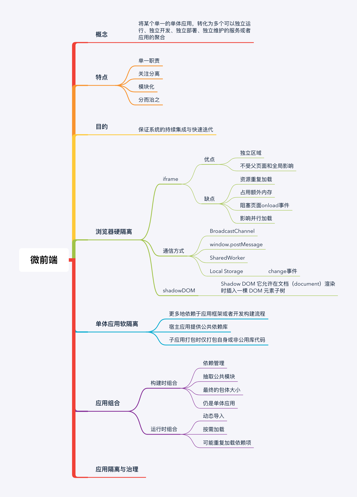

# ARTS第一周

## Alogorithm

1. Two Sum

Given an array of integers, return indices of the two numbers such that they add up to a specific target.

You may assume that each input would have exactly one solution, and you may not use the same element twice.

Example:

```javascript
Given nums = [2, 7, 11, 15], target = 9,

Because nums[0] + nums[1] = 2 + 7 = 9,
return [0, 1].

```

[https://github.com/SuperluminalSnails/leetcode/blob/master/001.Two%20Sum%20/Two%20Sum.md](https://github.com/SuperluminalSnails/leetcode/blob/master/001.Two%20Sum%20/Two%20Sum.md)


## ReView

这篇文章介绍了JavaScript的hosting机制，同时提到了JavaScript的运行方式。

[https://superluminalsnails.github.io/2019/08/14/理解JavaScript的变量提升（译）/](https://superluminalsnails.github.io/2019/08/14/理解JavaScript的变量提升（译）/)

## Tip

本周学习了chrome命令调试技巧和快速获取调用栈的方法

[https://juejin.im/post/5d598670f265da039d32cbed](https://juejin.im/post/5d598670f265da039d32cbed)

## Share


[微前端的设计理念与实践初探](https://zhuanlan.zhihu.com/p/41879781)

